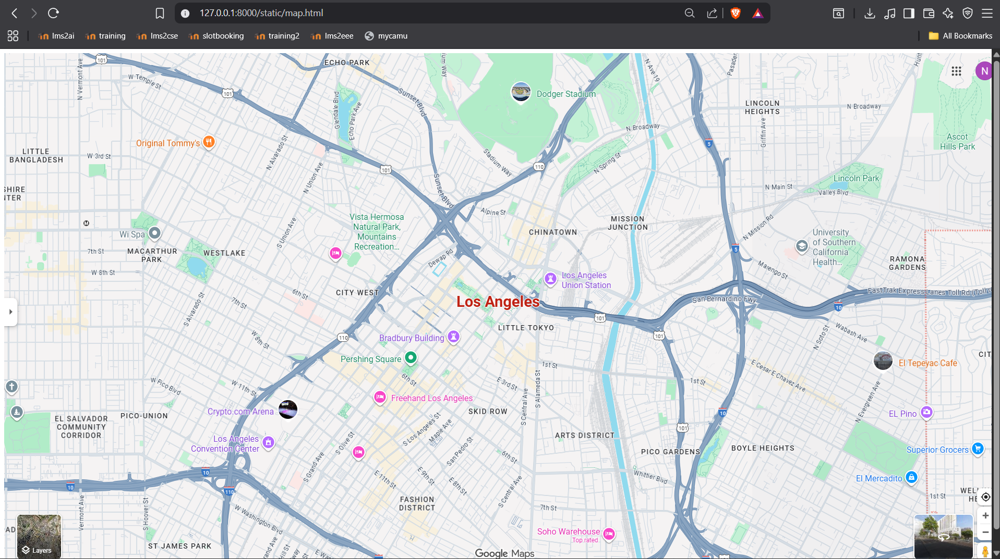
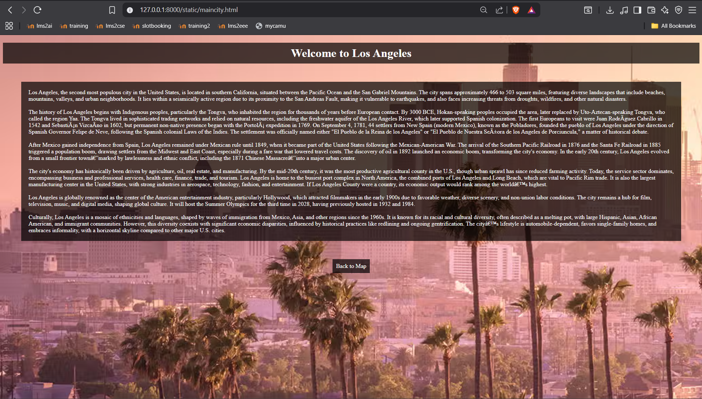
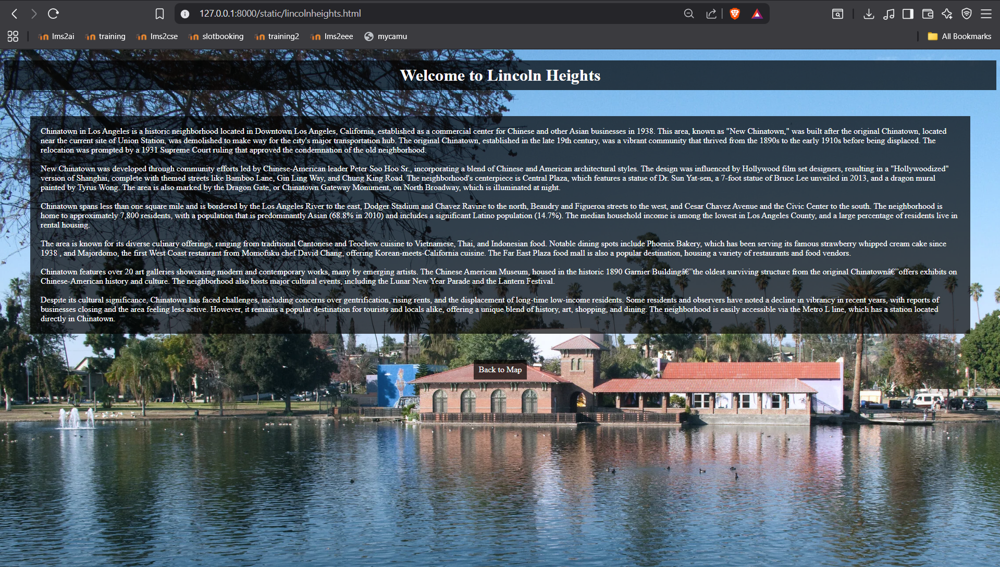
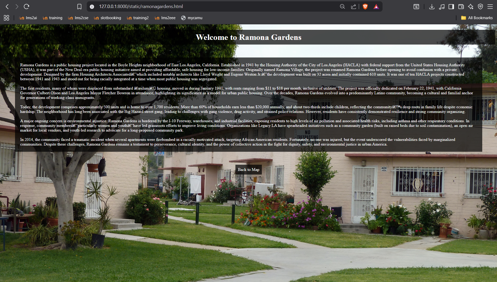
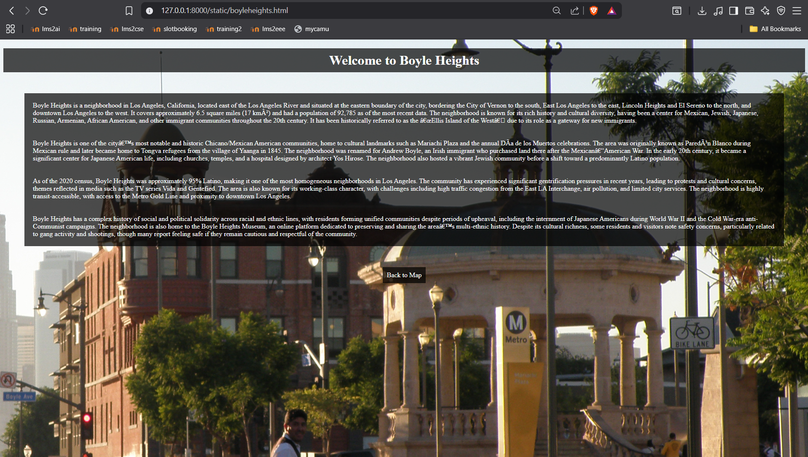
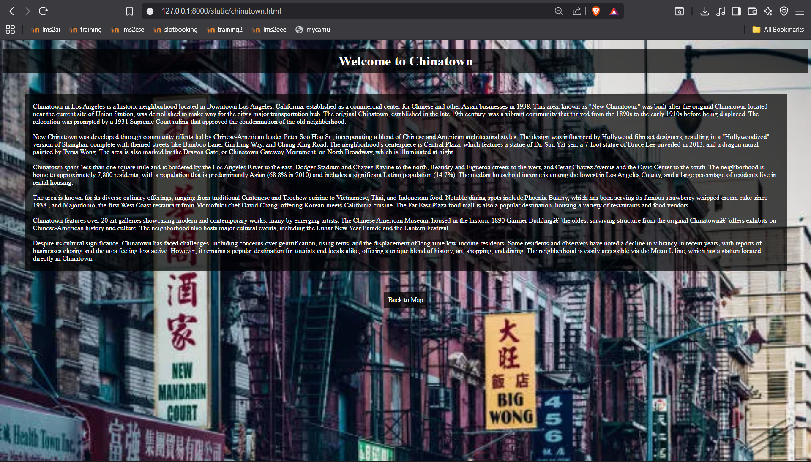
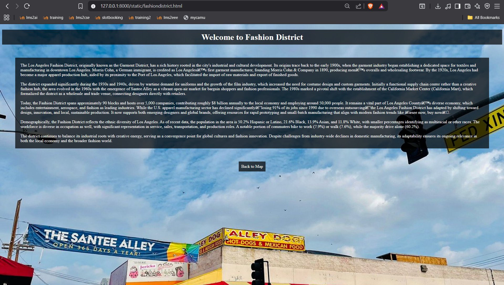
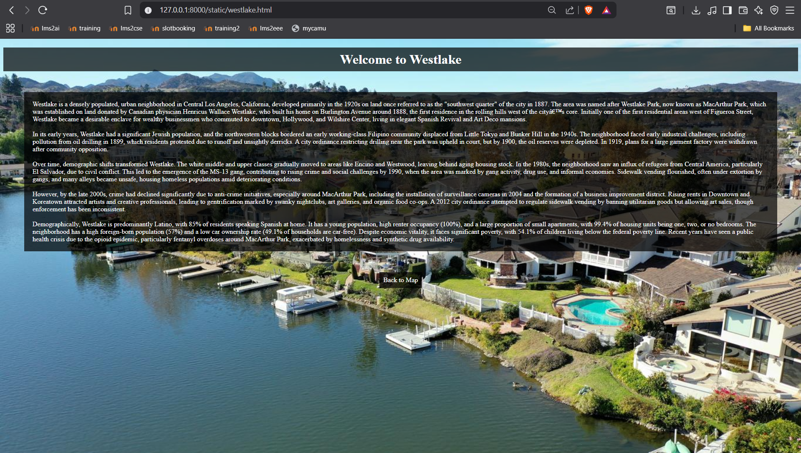
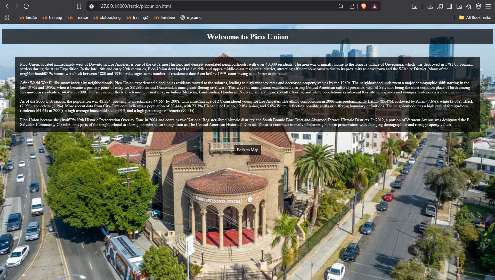

# Ex04 Places Around Me
## Date: 28/09/2025

## AIM
To develop a website to display details about the places around my house.

## DESIGN STEPS

### STEP 1
Create a Django admin interface.

### STEP 2
Download your city map from Google.

### STEP 3
Using ```<map>``` tag name the map.

### STEP 4
Create clickable regions in the image using ```<area>``` tag.

### STEP 5
Write HTML programs for all the regions identified.

### STEP 6
Execute the programs and publish them.

## CODE

```html

#maincode
<!DOCTYPE html>
<html>
<head>
<title>City Map</title>
</head>
<body>


<map name="image-map">
    <area target="" alt="Fashion District" title="Fashion District" href="fashiondistrict.html" coords="791,863,62" shape="circle">
    <area target="" alt="Chinatown" title="Chinatown" href="chinatown.html" coords="1054,346,70" shape="circle">
    <area target="" alt="Main City" title="Main City" href="maincity.html" coords="849,457,1049,497" shape="rect">
    <area target="" alt="Westlake" title="Westlake" href="westlake.html" coords="422,383,67" shape="circle">
    <area target="" alt="Ramona Gardens" title="Ramona Gardens" href="ramonagardens.html" coords="1727,394,104" shape="circle">
    <area target="" alt="Boyle Heights" title="Boyle Heights" href="boyleheights.html" coords="1453,758,80" shape="circle">
    <area target="" alt="Pico Union" title="Pico Union" href="picounion.html" coords="270,697,85" shape="circle">
    <area target="" alt="Lincoln Heights" title="Lincoln Heights" href="lincolnheights.html" coords="1462,106,122" shape="circle">
</map>

</body>
</html>

#maincity

<!DOCTYPE html>
<html>
<head>
<title>Los Angeles</title>
</head>
<body style="background-image: url('la.avif'); background-size: cover; background-repeat: no-repeat; background-attachment: fixed; color: white;">

<h1 style="text-align: center; background-color: rgba(0, 0, 0, 0.7); padding: 10px;">Welcome to Los Angeles</h1>

<p style="background-color: rgba(0, 0, 0, 0.7); padding: 20px; margin: 50px;">
    Los Angeles, the second most populous city in the United States, is located in southern California, situated between the Pacific Ocean and the San Gabriel Mountains.
 The city spans approximately 466 to 503 square miles, featuring diverse landscapes that include beaches, mountains, valleys, and urban neighborhoods.
 It lies within a seismically active region due to its proximity to the San Andreas Fault, making it vulnerable to earthquakes, and also faces increasing threats from droughts, wildfires, and other natural disasters.
<br>
<br>
The history of Los Angeles begins with Indigenous peoples, particularly the Tongva, who inhabited the region for thousands of years before European contact. By 3000 BCE, Hokan-speaking peoples occupied the area, later replaced by Uto-Aztecan-speaking Tongva, who called the region Yaa.
 The Tongva lived in sophisticated trading networks and relied on natural resources, including the freshwater aquifer of the Los Angeles River, which later supported Spanish colonization.
 The first Europeans to visit were Juan Rodríguez Cabrillo in 1542 and Sebastián Vizcaíno in 1602, but permanent non-native presence began with the Portolá expedition in 1769.
 On September 4, 1781, 44 settlers from New Spain (modern Mexico), known as the Pobladores, founded the pueblo of Los Angeles under the direction of Spanish Governor Felipe de Neve, following the Spanish colonial Laws of the Indies.
 The settlement was officially named either "El Pueblo de la Reina de los Angeles" or "El Pueblo de Nuestra Señora de los Angeles de Porciuncula," a matter of historical debate.
<br>
<br>
After Mexico gained independence from Spain, Los Angeles remained under Mexican rule until 1849, when it became part of the United States following the Mexican-American War.
 The arrival of the Southern Pacific Railroad in 1876 and the Santa Fe Railroad in 1885 triggered a population boom, drawing settlers from the Midwest and East Coast, especially during a fare war that lowered travel costs.
 The discovery of oil in 1892 launched an economic boom, transforming the city's economy.
 In the early 20th century, Los Angeles evolved from a small frontier town—marked by lawlessness and ethnic conflict, including the 1871 Chinese Massacre—into a major urban center.
<br>
<br>
The city's economy has historically been driven by agriculture, oil, real estate, and manufacturing.
 By the mid-20th century, it was the most productive agricultural county in the U.S., though urban sprawl has since reduced farming activity.
 Today, the service sector dominates, encompassing business and professional services, health care, finance, trade, and tourism.
 Los Angeles is home to the busiest port complex in North America, the combined ports of Los Angeles and Long Beach, which are vital to Pacific Rim trade.
 It is also the largest manufacturing center in the United States, with strong industries in aerospace, technology, fashion, and entertainment.
 If Los Angeles County were a country, its economic output would rank among the world’s highest.
<br>
<br>
Los Angeles is globally renowned as the center of the American entertainment industry, particularly Hollywood, which attracted filmmakers in the early 1900s due to favorable weather, diverse scenery, and non-union labor conditions.
 The city remains a hub for film, television, music, and digital media, shaping global culture.
 It will host the Summer Olympics for the third time in 2028, having previously hosted in 1932 and 1984.
<br>
<br>
Culturally, Los Angeles is a mosaic of ethnicities and languages, shaped by waves of immigration from Mexico, Asia, and other regions since the 1960s.
 It is known for its racial and cultural diversity, often described as a melting pot, with large Hispanic, Asian, African American, and immigrant communities.
 However, this diversity coexists with significant economic disparities, influenced by historical practices like redlining and ongoing gentrification.
 The city’s lifestyle is automobile-dependent, favors single-family homes, and embraces informality, with a horizontal skyline compared to other major U.S. cities.
</p>

<a href="map.html" style="background-color: rgba(0, 0, 0, 0.7); padding: 10px; text-decoration: none; color: white; display: block; width: fit-content; margin: 20px auto;">Back to Map</a>

</body>
</html>

#chinatown

<!DOCTYPE html>
<html>
<head>
<title>Chinatown</title>
</head>
<body style="background-image: url('chinatown.webp'); background-size: cover; background-repeat: no-repeat; background-attachment: fixed; color: white;">

<h1 style="text-align: center; background-color: rgba(0, 0, 0, 0.7); padding: 10px;">Welcome to Chinatown</h1>

<p style="background-color: rgba(0, 0, 0, 0.7); padding: 20px; margin: 50px;">
    Chinatown in Los Angeles is a historic neighborhood located in Downtown Los Angeles, California, established as a commercial center for Chinese and other Asian businesses in 1938.
 This area, known as "New Chinatown," was built after the original Chinatown, located near the current site of Union Station, was demolished to make way for the city's major transportation hub.
 The original Chinatown, established in the late 19th century, was a vibrant community that thrived from the 1890s to the early 1910s before being displaced.
 The relocation was prompted by a 1931 Supreme Court ruling that approved the condemnation of the old neighborhood.
<br>
<br>
New Chinatown was developed through community efforts led by Chinese-American leader Peter Soo Hoo Sr., incorporating a blend of Chinese and American architectural styles.
 The design was influenced by Hollywood film set designers, resulting in a "Hollywoodized" version of Shanghai, complete with themed streets like Bamboo Lane, Gin Ling Way, and Chung King Road.
 The neighborhood's centerpiece is Central Plaza, which features a statue of Dr. Sun Yat-sen, a 7-foot statue of Bruce Lee unveiled in 2013, and a dragon mural painted by Tyrus Wong.
 The area is also marked by the Dragon Gate, or Chinatown Gateway Monument, on North Broadway, which is illuminated at night.
<br>
<br>
Chinatown spans less than one square mile and is bordered by the Los Angeles River to the east, Dodger Stadium and Chavez Ravine to the north, Beaudry and Figueroa streets to the west, and Cesar Chavez Avenue and the Civic Center to the south.
 The neighborhood is home to approximately 7,800 residents, with a population that is predominantly Asian (68.8% in 2010) and includes a significant Latino population (14.7%).
 The median household income is among the lowest in Los Angeles County, and a large percentage of residents live in rental housing.
<br>
<br>
The area is known for its diverse culinary offerings, ranging from traditional Cantonese and Teochew cuisine to Vietnamese, Thai, and Indonesian food.
 Notable dining spots include Phoenix Bakery, which has been serving its famous strawberry whipped cream cake since 1938
 , and Majordomo, the first West Coast restaurant from Momofuku chef David Chang, offering Korean-meets-California cuisine.
 The Far East Plaza food mall is also a popular destination, housing a variety of restaurants and food vendors.
<br>
<br>
Chinatown features over 20 art galleries showcasing modern and contemporary works, many by emerging artists.
 The Chinese American Museum, housed in the historic 1890 Garnier Building—the oldest surviving structure from the original Chinatown—offers exhibits on Chinese-American history and culture.
 The neighborhood also hosts major cultural events, including the Lunar New Year Parade and the Lantern Festival.
<br>
<br>
Despite its cultural significance, Chinatown has faced challenges, including concerns over gentrification, rising rents, and the displacement of long-time low-income residents.
 Some residents and observers have noted a decline in vibrancy in recent years, with reports of businesses closing and the area feeling less active.
 However, it remains a popular destination for tourists and locals alike, offering a unique blend of history, art, shopping, and dining.
 The neighborhood is easily accessible via the Metro L line, which has a station located directly in Chinatown.
</p>

<a href="map.html" style="background-color: rgba(0, 0, 0, 0.7); padding: 10px; text-decoration: none; color: white; display: block; width: fit-content; margin: 20px auto;">Back to Map</a>

</body>
</html>

#boyleheights

<!DOCTYPE html>
<html>
<head>
<title>Boyle Heights</title>
</head>
<body style="background-image: url('boyle.jpg'); background-size: cover; background-repeat: no-repeat; background-attachment: fixed; color: white;">

<h1 style="text-align: center; background-color: rgba(0, 0, 0, 0.7); padding: 10px;">Welcome to Boyle Heights</h1>

<p style="background-color: rgba(0, 0, 0, 0.7); padding: 20px; margin: 50px;">
    Boyle Heights is a neighborhood in Los Angeles, California, located east of the Los Angeles River and situated at the eastern boundary of the city, bordering the City of Vernon to the south, East Los Angeles to the east, Lincoln Heights and El Sereno to the north, and downtown Los Angeles to the west.
 It covers approximately 6.5 square miles (17 km²) and had a population of 92,785 as of the most recent data.
 The neighborhood is known for its rich history and cultural diversity, having been a center for Mexican, Jewish, Japanese, Russian, Armenian, African American, and other immigrant communities throughout the 20th century.
 It has been historically referred to as the “Ellis Island of the West” due to its role as a gateway for new immigrants. <br>
<br>
<br>

Boyle Heights is one of the city’s most notable and historic Chicano/Mexican American communities, home to cultural landmarks such as Mariachi Plaza and the annual Día de los Muertos celebrations.
 The area was originally known as Paredón Blanco during Mexican rule and later became home to Tongva refugees from the village of Yaanga in 1845.
 The neighborhood was renamed for Andrew Boyle, an Irish immigrant who purchased land there after the Mexican–American War.
 In the early 20th century, it became a significant center for Japanese American life, including churches, temples, and a hospital designed by architect Yos Hirose.
 The neighborhood also hosted a vibrant Jewish community before a shift toward a predominantly Latino population.<br>
<br>
<br>
As of the 2020 census, Boyle Heights was approximately 95% Latino, making it one of the most homogeneous neighborhoods in Los Angeles.
 The community has experienced significant gentrification pressures in recent years, leading to protests and cultural concerns, themes reflected in media such as the TV series Vida and Gentefied.
 The area is also known for its working-class character, with challenges including high traffic congestion from the East LA Interchange, air pollution, and limited city services.
 The neighborhood is highly transit-accessible, with access to the Metro Gold Line and proximity to downtown Los Angeles.<br>
<br>
<br>
Boyle Heights has a complex history of social and political solidarity across racial and ethnic lines, with residents forming unified communities despite periods of upheaval, including the internment of Japanese Americans during World War II and the Cold War-era anti-Communist campaigns.
 The neighborhood is also home to the Boyle Heights Museum, an online platform dedicated to preserving and sharing the area’s multi-ethnic history.
 Despite its cultural richness, some residents and visitors note safety concerns, particularly related to gang activity and shootings, though many report feeling safe if they remain cautious and respectful of the community.
</p>

<a href="map.html" style="background-color: rgba(0, 0, 0, 0.7); padding: 10px; text-decoration: none; color: white; display: block; width: fit-content; margin: 20px auto;">Back to Map</a>

</body>
</html>

#fashiondistrict

<!DOCTYPE html>
<html>
<head>
<title>Fashion District</title>
</head>
<body style="background-image: url('fashion.jpg'); background-size: cover; background-repeat: no-repeat; background-attachment: fixed; color: white;">

<h1 style="text-align: center; background-color: rgba(0, 0, 0, 0.7); padding: 10px;">Welcome to Fashion District</h1>

<p style="background-color: rgba(0, 0, 0, 0.7); padding: 20px; margin: 50px;">
   The Los Angeles Fashion District, originally known as the Garment District, has a rich history rooted in the city's industrial and cultural development. Its origins trace back to the early 1900s, when the garment industry began establishing a dedicated space for textiles and manufacturing in downtown Los Angeles.
 Morris Cohn, a German immigrant, is credited as Los Angeles’s first garment manufacturer, founding Morris Cohn & Company in 1890, producing men’s overalls and wholesaling footwear.
 By the 1920s, Los Angeles had become a major apparel production hub, aided by its proximity to the Port of Los Angeles, which facilitated the import of raw materials and export of finished goods.
<br>
<br>
The district expanded significantly during the 1930s and 1940s, driven by wartime demand for uniforms and the growth of the film industry, which increased the need for costume design and custom garments.
 Initially a functional supply chain center rather than a creative fashion hub, the area evolved in the 1960s with the emergence of Santee Alley as a vibrant open-air market for bargain shoppers and fashion professionals.
 The 1980s marked a pivotal shift with the establishment of the California Market Center (California Mart), which formalized the district as a wholesale and trade venue, connecting designers directly with retailers.
<br>
<br>
Today, the Fashion District spans approximately 90 blocks and hosts over 5,000 companies, contributing roughly $8 billion annually to the local economy and employing around 50,000 people.
 It remains a vital part of Los Angeles County’s diverse economy, which includes entertainment, aerospace, and fashion as leading industries.
 While the U.S. apparel manufacturing sector has declined significantly—losing 91% of its jobs since 1990 due to overseas outsourcing—the Los Angeles Fashion District has adapted by shifting toward design, innovation, and local, sustainable production.
 It now supports both emerging designers and global brands, offering resources for rapid prototyping and small-batch manufacturing that align with modern fashion trends like “see now, buy now”.
<br>
<br>
Demographically, the Fashion District reflects the ethnic diversity of Los Angeles. As of recent data, the population in the area is 50.2% Hispanic or Latino, 21.6% Black, 13.9% Asian, and 11.8% White, with smaller percentages identifying as multiracial or other races.
 The workforce is diverse in occupation as well, with significant representation in service, sales, transportation, and production roles.
 A notable portion of commuters bike to work (7.9%) or walk (7.6%), while the majority drive alone (60.2%).
<br>
<br>
The district continues to balance its industrial roots with creative energy, serving as a convergence point for global cultures and fashion innovation. Despite challenges from industry-wide declines in domestic manufacturing, its adaptability ensures its ongoing relevance in both the local economy and the broader fashion world.
</p>

<a href="map.html" style="background-color: rgba(0, 0, 0, 0.7); padding: 10px; text-decoration: none; color: white; display: block; width: fit-content; margin: 20px auto;">Back to Map</a>

</body>
</html>

#picounion

<!DOCTYPE html>
<html>
<head>
<title>Pico Union</title>
</head>
<body style="background-image: url('pico.jpg'); background-size: cover; background-repeat: no-repeat; background-attachment: fixed; color: white;">

<h1 style="text-align: center; background-color: rgba(0, 0, 0, 0.7); padding: 10px;">Welcome to Pico Union</h1>

<p style="background-color: rgba(0, 0, 0, 0.7); padding: 20px; margin: 50px;">
    Pico-Union, located immediately west of Downtown Los Angeles, is one of the city's most historic and densely populated neighborhoods, with over 40,000 residents.
 The area was originally home to the Tongva village of Geveronga, which was destroyed in 1781 by Spanish settlers during the Anza Expedition.
 In the late 19th and early 20th centuries, Pico-Union developed as a middle and upper-middle-class residential district, attracting affluent homeowners due to its proximity to downtown and the Wilshire District.
 Many of the neighborhood’s homes were built between 1880 and 1930, and a significant number of residences date from before 1939, contributing to its historic character.
<br>
<br>
After World War II, like many inner-city neighborhoods, Pico-Union experienced a decline as residents moved to the suburbs, leading to high vacancy rates and decreased property values by the 1960s.
 The neighborhood underwent a major demographic shift starting in the late 1970s and 1980s, when it became a primary point of entry for Salvadoran and Guatemalan immigrants fleeing civil wars.
 This wave of immigration established a strong Central American cultural presence, with El Salvador being the most common place of birth among foreign-born residents at 44.4% in 2000.
 The area now reflects a rich multicultural mix, including Mexican, Guatemalan, Honduran, Nicaraguan, and more recently, Korean and white populations as adjacent Koreatown expands and younger professionals move in.
<br>
<br>
As of the 2000 U.S. census, the population was 42,324, growing to an estimated 44,664 by 2008, with a median age of 27, considered young for Los Angeles.
 The ethnic composition in 2000 was predominantly Latino (85.4%), followed by Asian (7.6%), white (3.0%), Black (2.9%), and others (1.1%).
 More recent data from City-Data.com indicates a population of 28,444, with 73.3% Hispanic or Latino, 12.8% Asian, and 5.6% White, reflecting possible shifts or differing boundary definitions.
 The neighborhood has a high rate of foreign-born residents (64.6% in 2000), a high average household size of 3.3, and a high percentage of renters (90.5%).
<br>
<br>
Pico-Union became the city’s 19th Historic Preservation Overlay Zone in 2004 and contains two National Register-listed historic districts: the South Bonnie Brae Tract and Alvarado Terrace Historic Districts.
 In 2012, a portion of Vermont Avenue was designated the El Salvador Community Corridor, and parts of the neighborhood are being considered for recognition as The Central American Historical District.
 The area continues to evolve, balancing historic preservation with changing demographics and rising property values.
</p>

<a href="map.html" style="background-color: rgba(0, 0, 0, 0.7); padding: 10px; text-decoration: none; color: white; display: block; width: fit-content; margin: 20px auto;">Back to Map</a>

</body>
</html>

#ramonagardens

<!DOCTYPE html>
<html>
<head>
<title>Ramona Gardens</title>
</head>
<body style="background-image: url('ramona.jpg'); background-size: cover; background-repeat: no-repeat; background-attachment: fixed; color: white;">

<h1 style="text-align: center; background-color: rgba(0, 0, 0, 0.7); padding: 10px;">Welcome to Ramona Gardens</h1>

<p style="background-color: rgba(0, 0, 0, 0.7); padding: 20px; margin: 50px;">
   Ramona Gardens is a public housing project located in the Boyle Heights neighborhood of East Los Angeles, California. Established in 1941 by the Housing Authority of the City of Los Angeles (HACLA) with federal support from the United States Housing Authority (USHA), it was part of the New Deal-era public housing initiative aimed at providing affordable, safe housing for low-income families. Originally named Ramona Village, the project was renamed Ramona Gardens before opening to avoid confusion with a private development. Designed by the firm Housing Architects Associated—which included notable architects like Lloyd Wright and Eugene Weston Jr.—the development was built on 32 acres and initially contained 610 units. It was one of ten HACLA projects constructed between 1941 and 1943 and stood out for being racially integrated at a time when most public housing was segregated.
<br>
<br>
The first residents, many of whom were displaced from substandard “slum” housing, moved in during January 1941, with rents ranging from $11 to $18 per month, inclusive of utilities. The project was officially dedicated on February 22, 1941, with California Governor Culbert Olson and Los Angeles Mayor Fletcher Bowron in attendance, highlighting its significance as a model for urban public housing. Over the decades, Ramona Gardens evolved into a predominantly Latino community, becoming a cultural and familial anchor for generations of working-class immigrants.
<br>
<br>
Today, the development comprises approximately 500 units and is home to over 1,700 residents. More than 60% of households earn less than $20,000 annually, and about two-thirds include children, reflecting the community’s deep roots in family life despite economic hardship. The neighborhood has long been associated with the Big Hazard street gang, leading to challenges with gang violence, drug activity, and strained police relations. However, residents have consistently demonstrated resilience and strong community organizing.
<br>
<br>
A major ongoing concern is environmental injustice. Ramona Gardens is bordered by the I-10 Freeway, warehouses, and industrial facilities, exposing residents to high levels of air pollution and associated health risks, including asthma and other respiratory conditions. In response, community members—particularly women and youth—have led grassroots efforts to improve living conditions. Organizations like Legacy LA have spearheaded initiatives such as a community garden (built on raised beds due to soil contamination), an open-air market for local vendors, and youth-led research to advocate for a long-proposed community park.
<br>
<br>
In 2014, the community faced a traumatic incident when several apartments were firebombed in a racially motivated attack, targeting African American residents. Fortunately, no one was injured, but the event underscored the vulnerabilities faced by marginalized communities. Despite these challenges, Ramona Gardens remains a testament to perseverance, cultural identity, and the power of collective action in the fight for dignity, safety, and environmental justice in urban America.
</p>

<a href="map.html" style="background-color: rgba(0, 0, 0, 0.7); padding: 10px; text-decoration: none; color: white; display: block; width: fit-content; margin: 20px auto;">Back to Map</a>

</body>
</html>

#westlake

<!DOCTYPE html>
<html>
<head>
<title>Westlake</title>
</head>
<body style="background-image: url('westlake.jpg'); background-size: cover; background-repeat: no-repeat; background-attachment: fixed; color: white;">

<h1 style="text-align: center; background-color: rgba(0, 0, 0, 0.7); padding: 10px;">Welcome to Westlake</h1>

<p style="background-color: rgba(0, 0, 0, 0.7); padding: 20px; margin: 50px;">
   Westlake is a densely populated, urban neighborhood in Central Los Angeles, California, developed primarily in the 1920s on land once referred to as the "southwest quarter" of the city in 1887.
 The area was named after Westlake Park, now known as MacArthur Park, which was established on land donated by Canadian physician Henricus Wallace Westlake, who built his home on Burlington Avenue around 1888, the first residence in the rolling hills west of the city’s core.
 Initially one of the first residential areas west of Figueroa Street, Westlake became a desirable enclave for wealthy businessmen who commuted to downtown, Hollywood, and Wilshire Center, living in elegant Spanish Revival and Art Deco mansions.
<br>
<br>
In its early years, Westlake had a significant Jewish population, and the northwestern blocks bordered an early working-class Filipino community displaced from Little Tokyo and Bunker Hill in the 1940s.
 The neighborhood faced early industrial challenges, including pollution from oil drilling in 1899, which residents protested due to runoff and unsightly derricks.
 A city ordinance restricting drilling near the park was upheld in court, but by 1900, the oil reserves were depleted.
 In 1919, plans for a large garment factory were withdrawn after community opposition.
<br>
<br>
Over time, demographic shifts transformed Westlake. The white middle and upper classes gradually moved to areas like Encino and Westwood, leaving behind aging housing stock.
 In the 1980s, the neighborhood saw an influx of refugees from Central America, particularly El Salvador, due to civil conflict.
 This led to the emergence of the MS-13 gang, contributing to rising crime and social challenges by 1990, when the area was marked by gang activity, drug use, and informal economies.
 Sidewalk vending flourished, often under extortion by gangs, and many alleys became unsafe, housing homeless populations amid deteriorating conditions.
<br>
<br>
However, by the late 2000s, crime had declined significantly due to anti-crime initiatives, especially around MacArthur Park, including the installation of surveillance cameras in 2004 and the formation of a business improvement district.
 Rising rents in Downtown and Koreatown attracted artists and creative professionals, leading to gentrification marked by swanky nightclubs, art galleries, and organic food co-ops.
 A 2012 city ordinance attempted to regulate sidewalk vending by banning utilitarian goods but allowing art sales, though enforcement has been inconsistent.
<br>
<br>
Demographically, Westlake is predominantly Latino, with 85% of residents speaking Spanish at home.
 It has a young population, high renter occupancy (100%), and a large proportion of small apartments, with 99.4% of housing units being one, two, or no bedrooms.
 The neighborhood has a high foreign-born population (57%) and a low car ownership rate (49.1% of households are car-free).
 Despite economic vitality, it faces significant poverty, with 54.1% of children living below the federal poverty line.
 Recent years have seen a public health crisis due to the opioid epidemic, particularly fentanyl overdoses around MacArthur Park, exacerbated by homelessness and synthetic drug availability.
</p>

<a href="map.html" style="background-color: rgba(0, 0, 0, 0.7); padding: 10px; text-decoration: none; color: white; display: block; width: fit-content; margin: 20px auto;">Back to Map</a>

</body>
</html>


#lincolnheights

<!DOCTYPE html>
<html>
<head>
<title>Lincoln Heights</title>
</head>
<body style="background-image: url('lincoln.webp'); background-size: cover; background-repeat: no-repeat; background-attachment: fixed; color: white;">

<h1 style="text-align: center; background-color: rgba(0, 0, 0, 0.7); padding: 10px;">Welcome to Lincoln Heights</h1>

<p style="background-color: rgba(0, 0, 0, 0.7); padding: 20px; margin: 50px;">
    Chinatown in Los Angeles is a historic neighborhood located in Downtown Los Angeles, California, established as a commercial center for Chinese and other Asian businesses in 1938.
 This area, known as "New Chinatown," was built after the original Chinatown, located near the current site of Union Station, was demolished to make way for the city's major transportation hub.
 The original Chinatown, established in the late 19th century, was a vibrant community that thrived from the 1890s to the early 1910s before being displaced.
 The relocation was prompted by a 1931 Supreme Court ruling that approved the condemnation of the old neighborhood.
<br>
<br>
New Chinatown was developed through community efforts led by Chinese-American leader Peter Soo Hoo Sr., incorporating a blend of Chinese and American architectural styles.
 The design was influenced by Hollywood film set designers, resulting in a "Hollywoodized" version of Shanghai, complete with themed streets like Bamboo Lane, Gin Ling Way, and Chung King Road.
 The neighborhood's centerpiece is Central Plaza, which features a statue of Dr. Sun Yat-sen, a 7-foot statue of Bruce Lee unveiled in 2013, and a dragon mural painted by Tyrus Wong.
 The area is also marked by the Dragon Gate, or Chinatown Gateway Monument, on North Broadway, which is illuminated at night.
<br>
<br>
Chinatown spans less than one square mile and is bordered by the Los Angeles River to the east, Dodger Stadium and Chavez Ravine to the north, Beaudry and Figueroa streets to the west, and Cesar Chavez Avenue and the Civic Center to the south.
 The neighborhood is home to approximately 7,800 residents, with a population that is predominantly Asian (68.8% in 2010) and includes a significant Latino population (14.7%).
 The median household income is among the lowest in Los Angeles County, and a large percentage of residents live in rental housing.
<br>
<br>
The area is known for its diverse culinary offerings, ranging from traditional Cantonese and Teochew cuisine to Vietnamese, Thai, and Indonesian food.
 Notable dining spots include Phoenix Bakery, which has been serving its famous strawberry whipped cream cake since 1938
 , and Majordomo, the first West Coast restaurant from Momofuku chef David Chang, offering Korean-meets-California cuisine.
 The Far East Plaza food mall is also a popular destination, housing a variety of restaurants and food vendors.
<br>
<br>
Chinatown features over 20 art galleries showcasing modern and contemporary works, many by emerging artists.
 The Chinese American Museum, housed in the historic 1890 Garnier Building—the oldest surviving structure from the original Chinatown—offers exhibits on Chinese-American history and culture.
 The neighborhood also hosts major cultural events, including the Lunar New Year Parade and the Lantern Festival.
<br>
<br>
Despite its cultural significance, Chinatown has faced challenges, including concerns over gentrification, rising rents, and the displacement of long-time low-income residents.
 Some residents and observers have noted a decline in vibrancy in recent years, with reports of businesses closing and the area feeling less active.
 However, it remains a popular destination for tourists and locals alike, offering a unique blend of history, art, shopping, and dining.
 The neighborhood is easily accessible via the Metro L line, which has a station located directly in Chinatown.
</p>

<a href="map.html" style="background-color: rgba(0, 0, 0, 0.7); padding: 10px; text-decoration: none; color: white; display: block; width: fit-content; margin: 20px auto;">Back to Map</a>

</body>
</html>


```

## OUTPUT












## RESULT
The program for implementing image maps using HTML is executed successfully.
